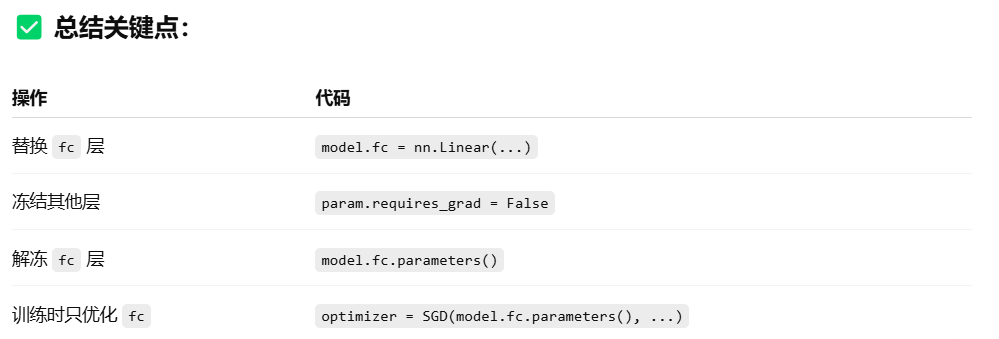

## 1.**微调在ImageNet上预训练好的Resnet18**

**问GPT的prompt：在imageNet上预训练好的Resnet18模型，如何只更改最后的全连接层神经元个数并只微调更改后的这几层全连接层的参数呢？**

------

要在 ImageNet 上预训练的 ResNet18 模型上 **只更改最后的全连接层（`fc` 层）的神经元个数**，并 **只微调（fine-tune）这个新加的层**，可以按照以下步骤进行：

------

### ✅ 1. 加载预训练的 ResNet18 模型

```python
import torch
import torch.nn as nn
from torchvision import models

# 加载 ImageNet 上预训练的 ResNet18
model = models.resnet18(pretrained=True)
```

### ✅ 2. 替换最后的全连接层（`fc`）

假设你要改成输出类别数为 `num_classes`：

```python
num_classes = 10  # 替换为你自己的类别数
model.fc = nn.Linear(model.fc.in_features, num_classes)
```


### ✅ 3. 冻结除最后一层以外的所有参数（只训练 fc）

```python
for param in model.parameters():
    param.requires_grad = False  # 冻结所有参数

for param in model.fc.parameters():
    param.requires_grad = True   # 只训练新的全连接层

```


✅ 4. 优化器中只传入可训练参数

```python
optimizer = torch.optim.SGD(model.fc.parameters(), lr=0.001, momentum=0.9)
```

### ✅ 5. 正常训练

继续编写 loss、forward、backward、step 的训练流程即可。你只会训练新加的最后一层。




下面是一个**完整的训练脚本模板**，用于加载 ImageNet 上预训练的 ResNet18，**替换最后一层为自定义输出类别数的新全连接层，并只微调这一层**：

✅ 完整训练脚本（只微调最后一层）

```python
import torch
import torch.nn as nn
import torch.optim as optim
from torchvision import datasets, transforms, models

# === 参数设置 ===
num_classes = 10  # 你的类别数
batch_size = 32
learning_rate = 0.001
num_epochs = 5
device = torch.device("cuda" if torch.cuda.is_available() else "cpu")

# === 数据预处理 ===
transform = transforms.Compose([
    transforms.Resize(224),
    transforms.ToTensor(),
    transforms.Normalize(mean=[0.485, 0.456, 0.406],
                         std=[0.229, 0.224, 0.225])
])

# === 加载数据集（以ImageFolder为例）===
train_dataset = datasets.ImageFolder(root='your_train_data_path', transform=transform)
train_loader = torch.utils.data.DataLoader(train_dataset, batch_size=batch_size, shuffle=True)

# === 加载预训练的 ResNet18 ===
model = models.resnet18(pretrained=True)

# === 替换最后的全连接层（fc） ===
model.fc = nn.Linear(model.fc.in_features, num_classes)

# === 冻结除最后一层以外的所有参数 ===
for param in model.parameters():
    param.requires_grad = False

# === 解冻最后一层（fc）参数 ===
for param in model.fc.parameters():
    param.requires_grad = True

# === 放入设备（GPU / CPU）===
model = model.to(device)

# === 定义损失函数和优化器（只优化 fc 层）===
criterion = nn.CrossEntropyLoss()
optimizer = optim.SGD(model.fc.parameters(), lr=learning_rate, momentum=0.9)

# === 开始训练 ===
model.train()
for epoch in range(num_epochs):
    running_loss = 0.0
    for images, labels in train_loader:
        images = images.to(device)
        labels = labels.to(device)

        optimizer.zero_grad()
        outputs = model(images)
        loss = criterion(outputs, labels)
        loss.backward()
        optimizer.step()

        running_loss += loss.item()
    
    print(f"Epoch {epoch+1}/{num_epochs}, Loss: {running_loss/len(train_loader):.4f}")

print("Finished Training!")

```

`your_train_data_path` 换成你自己的数据集路径（使用的是 `ImageFolder` 格式）。

如果你也想在验证集上评估精度，我可以帮你加验证部分。

若你将来希望微调更多层，只需设置更多层的 `requires_grad=True`。


好的，下面是一个**包含训练和验证过程的完整 PyTorch 微调脚本**，适用于**只微调 ImageNet 上预训练的 ResNet18 最后一层**，同时在验证集上评估精度。

✅ 完整训练+验证脚本（只微调 ResNet18 最后一层）

```python
import torch
import torch.nn as nn
import torch.optim as optim
from torchvision import datasets, transforms, models
from torch.utils.data import DataLoader
import time

# === 参数设置 ===
num_classes = 10  # 你的目标类别数
batch_size = 32
learning_rate = 0.001
num_epochs = 10
device = torch.device("cuda" if torch.cuda.is_available() else "cpu")

# === 数据预处理 ===
transform = transforms.Compose([
    transforms.Resize((224, 224)),
    transforms.ToTensor(),
    transforms.Normalize(mean=[0.485, 0.456, 0.406],
                         std=[0.229, 0.224, 0.225])
])

# === 加载训练和验证集 ===
train_dataset = datasets.ImageFolder(root='your_train_data_path', transform=transform)
val_dataset = datasets.ImageFolder(root='your_val_data_path', transform=transform)

train_loader = DataLoader(train_dataset, batch_size=batch_size, shuffle=True)
val_loader = DataLoader(val_dataset, batch_size=batch_size, shuffle=False)

# === 加载预训练模型并替换全连接层 ===
model = models.resnet18(pretrained=True)
model.fc = nn.Linear(model.fc.in_features, num_classes)

# === 冻结其他层，只训练最后一层 ===
for param in model.parameters():
    param.requires_grad = False
for param in model.fc.parameters():
    param.requires_grad = True

model = model.to(device)

# === 定义损失函数和优化器 ===
criterion = nn.CrossEntropyLoss()
optimizer = optim.SGD(model.fc.parameters(), lr=learning_rate, momentum=0.9)

# === 训练和验证循环 ===
for epoch in range(num_epochs):
    start_time = time.time()
    
    # === Training ===
    model.train()
    running_loss = 0.0
    correct = 0
    total = 0
    for images, labels in train_loader:
        images = images.to(device)
        labels = labels.to(device)

        optimizer.zero_grad()
        outputs = model(images)
        loss = criterion(outputs, labels)
        loss.backward()
        optimizer.step()

        running_loss += loss.item()
        _, preds = torch.max(outputs, 1)
        correct += (preds == labels).sum().item()
        total += labels.size(0)

    train_loss = running_loss / len(train_loader)
    train_acc = correct / total

    # === Validation ===
    model.eval()
    val_loss = 0.0
    correct = 0
    total = 0
    with torch.no_grad():
        for images, labels in val_loader:
            images = images.to(device)
            labels = labels.to(device)

            outputs = model(images)
            loss = criterion(outputs, labels)
            val_loss += loss.item()

            _, preds = torch.max(outputs, 1)
            correct += (preds == labels).sum().item()
            total += labels.size(0)

    val_loss = val_loss / len(val_loader)
    val_acc = correct / total

    elapsed = time.time() - start_time
    print(f"Epoch [{epoch+1}/{num_epochs}] - "
          f"Train Loss: {train_loss:.4f}, Train Acc: {train_acc:.4f}, "
          f"Val Loss: {val_loss:.4f}, Val Acc: {val_acc:.4f}, "
          f"Time: {elapsed:.2f}s")

print("Training complete!")

```

### 📁 你需要准备：

- `your_train_data_path`: 指向训练集文件夹（子文件夹名为类别名）
- `your_val_data_path`: 指向验证集文件夹（结构同上）


如果你想要微调 **ResNet18 的最后输出为 512 通道的部分（即最后的 `layer4` 模块）** 和 **更改后的全连接层**，你只需要：

------

### ✅ 步骤总结：

1. **加载预训练的 ResNet18**
2. **修改最后的全连接层**（如：`fc = nn.Linear(512, num_classes)`）
3. **只解冻 layer4 和 fc 的参数，其余部分冻结**

------

### 🔧 实现代码（只微调 `layer4` 和 `fc`）：

```python
import torch
import torch.nn as nn
from torchvision import models

num_classes = 10  # 根据任务修改
model = models.resnet18(pretrained=True)

# === 修改最后全连接层 ===
model.fc = nn.Linear(model.fc.in_features, num_classes)

# === 冻结所有层 ===
for param in model.parameters():
    param.requires_grad = False

# === 解冻 layer4（输出通道为 512） 和 fc 层 ===
for param in model.layer4.parameters():
    param.requires_grad = True
for param in model.fc.parameters():
    param.requires_grad = True

# === 把模型移到GPU ===
model = model.to('cuda' if torch.cuda.is_available() else 'cpu')

# === 设置优化器，只更新 layer4 和 fc 的参数 ===
optimizer = torch.optim.SGD(
    list(model.layer4.parameters()) + list(model.fc.parameters()),
    lr=0.001, momentum=0.9, weight_decay=1e-4
)

```

### 🧠 补充说明：

- `model.layer4` 是 ResNet18 的最后一个残差 block，输出通道正是 512。
- 这样做的好处是保留了底层通用特征，同时允许你细调任务相关的高层语义特征。
- 如果你未来要“继续解冻 layer3”，可以追加类似：

```python
for param in model.layer3.parameters():
    param.requires_grad = True

```


好的，下面是一个**完整的训练验证脚本**，以 `ImageNet` 上预训练的 `ResNet18` 为基础，仅**微调最后的 `layer4` 和更换后的 `fc` 层**。

------

### ✅ 微调 `ResNet18`（仅 `layer4` 和 `fc`）的完整 PyTorch 示例：

```python
import torch
import torch.nn as nn
import torch.optim as optim
from torchvision import datasets, transforms, models
from torch.utils.data import DataLoader

# === 参数 ===
num_classes = 10  # 根据你的任务修改
batch_size = 32
learning_rate = 0.001
num_epochs = 10

# === 数据预处理 ===
transform_train = transforms.Compose([
    transforms.Resize((224, 224)),
    transforms.RandomHorizontalFlip(),
    transforms.ToTensor(),
    transforms.Normalize(mean=[0.485, 0.456, 0.406],
                         std=[0.229, 0.224, 0.225])
])

transform_val = transforms.Compose([
    transforms.Resize((224, 224)),
    transforms.ToTensor(),
    transforms.Normalize(mean=[0.485, 0.456, 0.406],
                         std=[0.229, 0.224, 0.225])
])

# === 数据集路径（你需要替换成自己的） ===
train_dataset = datasets.ImageFolder("path/to/train", transform=transform_train)
val_dataset = datasets.ImageFolder("path/to/val", transform=transform_val)

train_loader = DataLoader(train_dataset, batch_size=batch_size, shuffle=True, num_workers=4)
val_loader = DataLoader(val_dataset, batch_size=batch_size, shuffle=False, num_workers=4)

# === 加载 ResNet18 模型并修改 fc 层 ===
model = models.resnet18(pretrained=True)
model.fc = nn.Linear(model.fc.in_features, num_classes)

# === 冻结所有参数 ===
for param in model.parameters():
    param.requires_grad = False

# === 解冻 layer4 和 fc 层 ===
for param in model.layer4.parameters():
    param.requires_grad = True
for param in model.fc.parameters():
    param.requires_grad = True

device = torch.device("cuda" if torch.cuda.is_available() else "cpu")
model = model.to(device)

# === 优化器仅更新 layer4 和 fc 参数 ===
optimizer = optim.SGD(
    list(model.layer4.parameters()) + list(model.fc.parameters()),
    lr=learning_rate, momentum=0.9, weight_decay=1e-4
)

# === 损失函数 ===
criterion = nn.CrossEntropyLoss()

# === 训练与验证 ===
for epoch in range(num_epochs):
    model.train()
    running_loss = 0.0
    correct = 0
    total = 0
    for images, labels in train_loader:
        images, labels = images.to(device), labels.to(device)

        optimizer.zero_grad()
        outputs = model(images)
        loss = criterion(outputs, labels)
        loss.backward()
        optimizer.step()

        running_loss += loss.item() * images.size(0)
        _, predicted = outputs.max(1)
        total += labels.size(0)
        correct += predicted.eq(labels).sum().item()

    train_loss = running_loss / total
    train_acc = correct / total

    # === 验证 ===
    model.eval()
    val_loss = 0.0
    correct = 0
    total = 0
    with torch.no_grad():
        for images, labels in val_loader:
            images, labels = images.to(device), labels.to(device)
            outputs = model(images)
            loss = criterion(outputs, labels)

            val_loss += loss.item() * images.size(0)
            _, predicted = outputs.max(1)
            total += labels.size(0)
            correct += predicted.eq(labels).sum().item()

    val_loss /= total
    val_acc = correct / total

    print(f"Epoch [{epoch+1}/{num_epochs}] "
          f"Train Loss: {train_loss:.4f}, Train Acc: {train_acc:.4f}, "
          f"Val Loss: {val_loss:.4f}, Val Acc: {val_acc:.4f}")

```

### ✅ 功能回顾：

- 使用 `ImageFolder` 加载数据（你需准备训练集和验证集）。
- 仅微调 `layer4` 和 `fc`，其他参数冻结。
- 优化器只更新需要训练的部分。
- 简洁的训练 + 验证过程。


好的，下面是**完整的训练脚本（支持 TensorBoard 可视化 + 保存验证集准确率最高的模型）**，在之前基础上添加了以下功能：

### ✅ 新增功能：

- 使用 `torch.utils.tensorboard.SummaryWriter` 实时记录损失和准确率；
- 保存验证集准确率最高的模型到指定路径；
- 日志输出更清晰。

------

### ✅ 完整代码（含 TensorBoard + 保存最优模型）：


```python
import torch
import torch.nn as nn
import torch.optim as optim
from torchvision import datasets, transforms, models
from torch.utils.data import DataLoader
from torch.utils.tensorboard import SummaryWriter
import os

# === 参数 ===
num_classes = 10
batch_size = 32
learning_rate = 0.001
num_epochs = 10
save_path = "best_model.pth"
log_dir = "runs/resnet18_finetune"

# === TensorBoard 记录器 ===
writer = SummaryWriter(log_dir=log_dir)

# === 数据预处理 ===
transform_train = transforms.Compose([
    transforms.Resize((224, 224)),
    transforms.RandomHorizontalFlip(),
    transforms.ToTensor(),
    transforms.Normalize(mean=[0.485, 0.456, 0.406],
                         std=[0.229, 0.224, 0.225])
])
transform_val = transforms.Compose([
    transforms.Resize((224, 224)),
    transforms.ToTensor(),
    transforms.Normalize(mean=[0.485, 0.456, 0.406],
                         std=[0.229, 0.224, 0.225])
])

# === 加载数据集 ===
train_dataset = datasets.ImageFolder("path/to/train", transform=transform_train)
val_dataset = datasets.ImageFolder("path/to/val", transform=transform_val)
train_loader = DataLoader(train_dataset, batch_size=batch_size, shuffle=True, num_workers=4)
val_loader = DataLoader(val_dataset, batch_size=batch_size, shuffle=False, num_workers=4)

# === 模型加载与参数设置 ===
model = models.resnet18(pretrained=True)
model.fc = nn.Linear(model.fc.in_features, num_classes)

# 冻结所有参数
for param in model.parameters():
    param.requires_grad = False
# 仅训练 layer4 和 fc
for param in model.layer4.parameters():
    param.requires_grad = True
for param in model.fc.parameters():
    param.requires_grad = True

device = torch.device("cuda" if torch.cuda.is_available() else "cpu")
model = model.to(device)

optimizer = optim.SGD(
    list(model.layer4.parameters()) + list(model.fc.parameters()),
    lr=learning_rate, momentum=0.9, weight_decay=1e-4
)
criterion = nn.CrossEntropyLoss()

# === 训练与验证 ===
best_val_acc = 0.0
for epoch in range(num_epochs):
    model.train()
    running_loss = 0.0
    correct = 0
    total = 0
    for images, labels in train_loader:
        images, labels = images.to(device), labels.to(device)

        optimizer.zero_grad()
        outputs = model(images)
        loss = criterion(outputs, labels)
        loss.backward()
        optimizer.step()

        running_loss += loss.item() * images.size(0)
        _, predicted = outputs.max(1)
        total += labels.size(0)
        correct += predicted.eq(labels).sum().item()

    train_loss = running_loss / total
    train_acc = correct / total

    # === 验证 ===
    model.eval()
    val_loss = 0.0
    correct = 0
    total = 0
    with torch.no_grad():
        for images, labels in val_loader:
            images, labels = images.to(device), labels.to(device)
            outputs = model(images)
            loss = criterion(outputs, labels)

            val_loss += loss.item() * images.size(0)
            _, predicted = outputs.max(1)
            total += labels.size(0)
            correct += predicted.eq(labels).sum().item()

    val_loss /= total
    val_acc = correct / total

    # === 写入 TensorBoard ===
    writer.add_scalar("Loss/Train", train_loss, epoch)
    writer.add_scalar("Loss/Val", val_loss, epoch)
    writer.add_scalar("Accuracy/Train", train_acc, epoch)
    writer.add_scalar("Accuracy/Val", val_acc, epoch)

    print(f"[Epoch {epoch+1}/{num_epochs}] "
          f"Train Loss: {train_loss:.4f}, Train Acc: {train_acc:.4f} | "
          f"Val Loss: {val_loss:.4f}, Val Acc: {val_acc:.4f}")

    # === 保存最优模型 ===
    if val_acc > best_val_acc:
        best_val_acc = val_acc
        torch.save(model.state_dict(), save_path)
        print(f"✅ Saved best model with val acc: {val_acc:.4f}")

writer.close()

```

### 📌 使用方法提醒：

1. 替换 `"path/to/train"` 和 `"path/to/val"` 为你的数据集路径；
2. 如果你用的是 `.py` 脚本，运行后使用命令打开 TensorBoard：

```python
tensorboard --logdir=runs/resnet18_finetune

```

   3.输出模型保存在当前目录的 `best_model.pth` 文件中。


下面是你要求的 **推理测试脚本（针对整个文件夹）**，功能如下：

------

### ✅ 功能概述：

- 加载训练好的 ResNet-18 微调模型；

- 对测试集中每张图片进行预测；

- 输出预测标签与真实标签；

- 计算并 **保存最终 Top-1 分类准确率**；

- 支持 GPU，自动适配。

  ✅ 推理代码（测试整个文件夹 + 保存 Top-1 准确率）

  ```python
  import torch
  from torchvision import models, transforms, datasets
  from torch.utils.data import DataLoader
  import os
  
  # === 参数设置 ===
  model_path = "best_model.pth"
  test_dir = "path/to/test"  # 测试集文件夹，要求为 ImageFolder 格式：test/class_x/*.jpg
  batch_size = 32
  num_classes = 10
  device = torch.device("cuda" if torch.cuda.is_available() else "cpu")
  
  # === 类别名（按ImageFolder自动排序）===
  class_names = sorted(os.listdir(test_dir))  # 或手动指定类别顺序
  
  # === 数据预处理 ===
  transform = transforms.Compose([
      transforms.Resize((224, 224)),
      transforms.ToTensor(),
      transforms.Normalize(mean=[0.485, 0.456, 0.406],
                           std=[0.229, 0.224, 0.225])
  ])
  
  # === 测试集加载 ===
  test_dataset = datasets.ImageFolder(root=test_dir, transform=transform)
  test_loader = DataLoader(test_dataset, batch_size=batch_size, shuffle=False, num_workers=4)
  
  # === 模型加载 ===
  model = models.resnet18(pretrained=False)
  model.fc = torch.nn.Linear(model.fc.in_features, num_classes)
  model.load_state_dict(torch.load(model_path, map_location=device))
  model = model.to(device)
  model.eval()
  
  # === 推理 + 计算准确率 ===
  correct = 0
  total = 0
  
  with torch.no_grad():
      for images, labels in test_loader:
          images, labels = images.to(device), labels.to(device)
          outputs = model(images)
          _, predicted = outputs.max(1)
          total += labels.size(0)
          correct += predicted.eq(labels).sum().item()
  
  top1_acc = correct / total
  print(f"✅ Top-1 Accuracy on Test Set: {top1_acc:.4f}")
  
  # === 保存准确率结果 ===
  with open("test_accuracy.txt", "w") as f:
      f.write(f"Top-1 Accuracy: {top1_acc:.4f}\n")
  
  ```

  

✅ 目录要求（ImageFolder 结构）：

```python
path/to/test/
    ├── class0/
    │   ├── img001.jpg
    │   └── ...
    ├── class1/
    │   ├── img021.jpg
    │   └── ...
    └── ...

```

### 📌 输出结果：

- 控制台打印：Top-1 Accuracy；
- 文本文件保存：`test_accuracy.txt`


## 2.实现多分类：


**prompt:**

根据以上文件，请帮我实现：

①分类网络：根据test_fine-tuning_new.py文件微调最后layer4和全连接层的网络作为Teacher网络，其对应微调的参数已经保存在D:\Projects\DeSTSeg\destseg++\eval-master\all_classify_eval-master\logs\fine_tuning\fold_9_best.pth中，让微调过后的这个整个resnet网络作为分类网络来实现判断每个图像所属类别（或每个batch图像所属类别）。教师网络：教师网络TeacherNet继续使用timm创建的ResNet来对学生网络实现蒸馏。（其中：利用layer1到layer3实现对学生网络的蒸馏）  注意：此处的分类网络是已经微调好的，教师网络是直接加载timm创建的ResNet参数，这是两个不同的resnet网络模型

②将学生网络模型的encoder部分设置为MVTECAD的15个类公用的学生网络encoder（OCBE部分也是共享的模块），decoder部分和segmentation_net部分设置为每类所特有的部分{其中：encoder定义为一个类，decoder定义为一个类，SegmentationNet定义为一个类}

③训练阶段：对于每个obj，调用train函数，依次处理每个类别。在训练某个类别时，加载对应的decoder和seg_net，与学生网络模型通用的encoder部分进行拼接，来实现蒸馏训练。

测试阶段：同理，首先将测试图像输入teacher网络，根据teacher网络判断出是哪一类别，然后加载对应类别训练好的decoder部分和segmentation_net部分；然后再实现将测试图像输入学生网络，实现最终结果的计算。

数据集文件路径及格式：mvtec —> bottle,cable,capsule,carpet,grid,hazelnut,leather,metal_nut,pill,screw,tile,toothbrush,transistor,wood,zipper—>ground_truth,test,train—>

①不需要冻结共享编码器，在训练每一个类别的时候，都加载共享编码器的权重参数，②共享编码器的参数也需要反向传播更新③在def train函数保存最佳模型的时候，也需要保存共享编码器部分的参数（共享编码器参数放在一个文件夹中），各个类别对应的解码器和语义分割网络的参数放在一个对应的文件夹中。④训练或者测试阶段：都需要加载共享编码器的参数，然后根据对应类别再加载对应的类别解码器和类别分割器的参数

### ① 分类网络和教师网络实现

```python
# 新增分类网络（需在模型定义文件中添加）
class ClassNet(nn.Module):
    def __init__(self, pretrained_path):
        super().__init__()
        self.backbone = models.resnet18(pretrained=False)
        self.backbone.fc = nn.Linear(512, 15)  # 15个类别
        state_dict = torch.load(pretrained_path, map_location="cuda")
        self.backbone.load_state_dict(state_dict)
        self.backbone.eval()
        
    def forward(self, x):
        with torch.no_grad():
            return self.backbone(x)

# 修改教师网络（原TeacherNet保持不变，新增特征提取方法）
class TeacherNet(nn.Module):
    def __init__(self):
        super().__init__()
        self.encoder = timm.create_model(
            "resnet18",
            pretrained=True,
            features_only=True,
            out_indices=[1, 2, 3],  # 只获取前三个stage的特征
        )
        for param in self.encoder.parameters():
            param.requires_grad = False

    def forward(self, x):
        self.eval()
        features = self.encoder(x)
        return features  # 返回tuple包含三个层次的特征
```


### ② 学生网络结构调整

```python
# 在model/destseg_old.py中修改
class SharedEncoder(nn.Module):
    def __init__(self):
        super().__init__()
        self.encoder = timm.create_model(
            "resnet18",
            pretrained=False,
            features_only=True,
            out_indices=[1, 2, 3, 4],
        )
        self.bn = nn.BatchNorm2d(448)  # 原OCBE模块的实现
        # 初始化代码参考原StudentNet的实现

    def forward(self, x):
        x1, x2, x3, x4 = self.encoder(x)
        x = torch.cat([x1, x2, x3], dim=1)
        x = self.bn(x)
        return x

class DeSTSeg(nn.Module):
    def __init__(self, num_classes=15):
        super().__init__()
        self.shared_encoder = SharedEncoder()
        self.decoders = nn.ModuleList(
            [self._build_decoder() for _ in range(num_classes)]
        )
        self.seg_nets = nn.ModuleList(
            [SegmentationNet() for _ in range(num_classes)]
        )

    def _build_decoder(self):
        # 原StudentNet的decoder实现
        decoder = nn.Sequential(
            make_layer(BasicBlock, 512, 512, 2),
            nn.Upsample(scale_factor=2, mode='bilinear'),
            make_layer(BasicBlock, 512, 256, 2),
            # ... 其他层定义
        )
        return decoder

    def forward(self, x, class_idx):
        features = self.shared_encoder(x)
        decoded = self.decoders[class_idx](features)
        output = self.seg_nets[class_idx](decoded)
        return output
```


### ③ 训练流程改造

```python
# 修改train函数（文档1）
def train(args, category, class_idx):
    # 初始化模型
    model = DeSTSeg(num_classes=15).cuda()
    teacher = TeacherNet().cuda()
    class_net = ClassNet("D:/path/to/fold_9_best.pth").cuda()

    # 仅优化当前类别的参数
    optimizer = torch.optim.SGD([
        {'params': model.shared_encoder.parameters()},
        {'params': model.decoders[class_idx].parameters()},
        {'params': model.seg_nets[class_idx].parameters()}
    ], lr=0.001)

    # 加载当前类别数据（需修改MVTecDataset）
    dataset = MVTecDataset(
        is_train=True,
        classname=category,
        mvtec_dir=os.path.join(args.mvtec_path, category, "train/good/"),
        # ...其他参数
    )
    
    for batch in DataLoader(dataset, batch_size=32):
        img_aug = batch["img_aug"].cuda()
        img_origin = batch["img_origin"].cuda()

        # 教师网络蒸馏
        with torch.no_grad():
            teacher_features = teacher(img_aug)

        # 学生网络前向
        student_features = model.shared_encoder(img_aug)
        output_segmentation = model.seg_nets[class_idx](
            model.decoders[class_idx](student_features)
        )

        # 计算蒸馏损失
        distillation_loss = sum(
            F.mse_loss(student_features[i], teacher_features[i].detach())
            for i in range(3)
        )
        
        # 原分割损失计算
        mask = F.interpolate(batch["mask"].cuda(), size=output_segmentation.shape[2:])
        seg_loss = focal_loss(output_segmentation, mask)
        
        total_loss = distillation_loss + seg_loss
        total_loss.backward()
        optimizer.step()
```


### ④ 测试流程改造

```python
# 修改evaluate函数（文档3）
def evaluate(args, category, model):
    class_net = ClassNet("D:/path/to/fold_9_best.pth").cuda()
    model.eval()
    
    dataset = MVTecDataset(
        is_train=False,
        classname=category,
        mvtec_dir=os.path.join(args.mvtec_path, category, "test/")
    )
    
    for batch in DataLoader(dataset, batch_size=32):
        img = batch["img"].cuda()
        
        # 分类网络预测类别
        with torch.no_grad():
            cls_logits = class_net(img)
            pred_class = torch.argmax(cls_logits, dim=1).item()

        # 加载对应类别的模块
        output = model(img, pred_class)
        
        # 后续评估逻辑保持不变...
        mask = batch["mask"].cuda()
        # 计算metrics...
```

### 关键文件结构调整

```
destseg/
├── class_net.py          # 分类网络定义
├── teacher_net.py        # 教师网络定义
├── student_net/
│   ├── shared_encoder.py # 共享编码器
│   ├── decoders/         # 每个类别的解码器
│   └── seg_nets/         # 每个类别的分割头
└── train.py              # 改造后的训练流程
```

### 训练执行逻辑

```python
# 主程序修改（文档1最后部分）
if __name__ == "__main__":
    # 初始化分类网络
    class_net = ClassNet("D:/path/to/fold_9_best.pth").cuda()
    
    # 按类别循环训练
    for idx, category in enumerate(ALL_CATEGORY):
        print(f"Training {category} (Class Index: {idx})")
        
        # 初始化学生模型
        model = DeSTSeg(num_classes=15).cuda()
        
        # 加载已有checkpoint（如果有）
        ckpt_path = f"saved_models/{category}_model.pth"
        if os.path.exists(ckpt_path):
            model.load_state_dict(torch.load(ckpt_path))
            
        # 训练当前类别
        train(args, category, class_idx=idx)
        
        # 保存当前类别参数
        torch.save({
            'shared_encoder': model.shared_encoder.state_dict(),
            'decoder': model.decoders[idx].state_dict(),
            'seg_net': model.seg_nets[idx].state_dict()
        }, ckpt_path)
```

### 关键改进点说明

1. **参数隔离机制**：

- 使用`nn.ModuleList`实现参数隔离
- 每个类别的decoder和seg_net独立保存
- 训练时通过class_idx动态选择模块

1. **内存优化**：

- 共享编码器参数在所有类别间复用
- 每个类别训练时只需加载当前类别的特定参数

1. **灵活部署**：

- 测试时通过分类网络自动路由
- 支持按需加载单个类别模型

1. **兼容性保持**：

- 保留原有损失函数和评估指标
- 仅修改模型结构和训练流程

建议在实际使用中通过以下命令进行训练：

```python
# 单类别训练示例
python train.py --category capsule --class_idx 0
# 全类别顺序训练
python train.py --all_categories
```


### 1. 分类网络实现（微调ResNet）

```python
import timm
import torch
import torch.nn as nn

class FineTunedClassifier(nn.Module):
    def __init__(self, num_classes=15):
        super().__init__()
        self.base_model = timm.create_model("resnet18", pretrained=False)
        self.base_model.fc = nn.Linear(512, num_classes)
        self._load_pretrained("destseg++/eval-master/all_classify_eval-master/logs/fine_tuning/fold_9_best.pth")

    def _load_pretrained(self, ckpt_path):
        state_dict = torch.load(ckpt_path)
        self.load_state_dict(state_dict)
        for param in self.parameters():
            param.requires_grad = False

    def forward(self, x):
        return self.base_model(x)
```


### 2. 改进的学生网络结构

```python
class SharedEncoder(nn.Module):
    def __init__(self):
        super().__init__()
        self.encoder = timm.create_model(
            "resnet18", pretrained=False, features_only=True, out_indices=[1, 2, 3, 4]
        )
        self.bn = nn.BatchNorm2d(448)  # OCBE模块

    def forward(self, x):
        x1, x2, x3, x4 = self.encoder(x)
        return [x1, x2, x3]

class ClassSpecificDecoder(nn.Module):
    def __init__(self, ed=True):
        super().__init__()
        if ed:
            self.decoder_layer4 = make_layer(BasicBlock, 512, 512, 2)
            self.decoder_layer3 = make_layer(BasicBlock, 512, 256, 2)
            self.decoder_layer2 = make_layer(BasicBlock, 256, 128, 2)
            self.decoder_layer1 = make_layer(BasicBlock, 128, 64, 2)

    def forward(self, x_list):
        # 与原StudentNet相同的decoder逻辑
        x = self.bn(x_list)
        b4 = self.decoder_layer4(x)
        b3 = F.interpolate(b4, size=x3.size()[2:], mode="bilinear")
        # ... 后续decoder操作
        return (b1, b2, b3)

class ClassSpecificSegNet(nn.Module):
    def __init__(self):
        super().__init__()
        self.seg_net = SegmentationNet()
    
    def forward(self, x):
        return self.seg_net(x)
```

### 3. 改进的DeSTSeg类

```python
class EnhancedDeSTSeg(nn.Module):
    def __init__(self, category):
        super().__init__()
        # 教师网络（保持原状）
        self.teacher_net = TeacherNet()
        
        # 共享组件
        self.shared_encoder = SharedEncoder()
        
        # 类别特定组件
        self.decoder = ClassSpecificDecoder()
        self.seg_net = ClassSpecificSegNet()
        
        # 加载类别特定参数
        self._load_category_params(category)

    def _load_category_params(self, category):
        # 加载指定类别的decoder和seg_net参数
        ckpt_path = f"saved_models/{category}_params.pth"
        if os.path.exists(ckpt_path):
            params = torch.load(ckpt_path)
            self.decoder.load_state_dict(params['decoder'])
            self.seg_net.load_state_dict(params['seg_net'])

    def forward(self, img_aug, img_origin=None):
        # 共享特征提取
        shared_features = self.shared_encoder(img_aug)
        
        # 类别特定处理
        decoder_out = self.decoder(shared_features)
        seg_out = self.seg_net(decoder_out)
        
        # 与原逻辑相同的后续处理
        # ...
        return seg_out, de_st_out, de_st_list, contrast
```

### 4. 改进的训练流程

```python
def train(args, category):
    # 初始化共享组件
    shared_encoder = SharedEncoder().cuda()
    
    # 初始化类别特定组件
    decoder = ClassSpecificDecoder().cuda()
    seg_net = ClassSpecificSegNet().cuda()
    
    # 优化器设置
    seg_optimizer = torch.optim.SGD([
        {"params": shared_encoder.parameters(), "lr": 0.04},
        {"params": decoder.parameters(), "lr": 0.11},
        {"params": seg_net.parameters(), "lr": 0.012}
    ], momentum=0.9)

    # 训练循环
    for step in range(args.steps):
        # 前向传播
        output_seg = seg_net(decoder(shared_encoder(img_aug)))
        
        # 损失计算和反向传播
        loss.backward()
        seg_optimizer.step()

    # 保存类别特定参数
    torch.save({
        "decoder": decoder.state_dict(),
        "seg_net": seg_net.state_dict()
    }, f"saved_models/{category}_params.pth")
```

### 5. 改进的测试流程

```python
def test(args):
    # 初始化分类网络
    classifier = FineTunedClassifier()
    
    # 初始化共享组件
    shared_encoder = SharedEncoder()
    
    for img in test_imgs:
        # 1. 分类确定类别
        with torch.no_grad():
            pred = classifier(img)
            category = ALL_CATEGORY[torch.argmax(pred)]
        
        # 2. 加载对应类别的模型
        model = EnhancedDeSTSeg(category)
        
        # 3. 执行异常检测
        seg_map, de_st_map = model(img)
```

### 文件结构建议

```
destseg/
├── shared_components/
│   ├── shared_encoder.pth
├── category_components/
│   ├── bottle/
│   │   ├── decoder.pth
│   │   └── seg_net.pth
│   └── cable/
│       ├── decoder.pth
│       └── seg_net.pth
└── configs/
    └── category_split.json
```

### 关键改进点说明：

1.**参数共享机制**：

- 共享编码器参数存储于`shared_encoder.pth`
- 类别特定参数按类别分别存储
- 训练时通过`torch.save`/`torch.load`实现参数分离

2.**动态加载机制**：

```python
# 在EnhancedDeSTSeg初始化时自动加载对应类别的参数
def __init__(self, category):
    self._load_category_params(category)
```

3.**分类网络集成**：

```python
# 在测试流程开始时先进行分类
pred = classifier(img)
category = ALL_CATEGORY[torch.argmax(pred)]
```

4.**训练流程优化**：

```python
# 每个类别训练时只更新：
# 1. 共享编码器（所有类别共用）
# 2. 当前类别的decoder和seg_net
optimizer = torch.optim.SGD([
    {"params": shared_encoder.parameters()},  # 共享
    {"params": current_decoder.parameters()},  # 当前类别
    {"params": current_seg_net.parameters()}  # 当前类别
])
```

以上实现需要配合以下调整：

1. 修改数据加载逻辑，确保不同类别训练时加载对应参数
2. 增加参数管理工具函数
3. 完善模型保存/加载的异常处理
4. 添加多GPU训练支持（如需）

建议在实际部署时添加：

1. 参数版本控制
2. 训练状态保存/恢复
3. 更完善的分类失败处理机制
4. 类别间参数冲突检测机制

这种架构可以较好地平衡模型性能与参数效率，同时保持对不同类别异常特征的针对性处理能力。


prompt：

帮我把学生网络的SharedEncoder部分（共享组件）换与TeacherNet一样的在imagenet上预训练好的resnet18网络模型，且保持原来的SharedEncoder部分的输入和输出不变。


